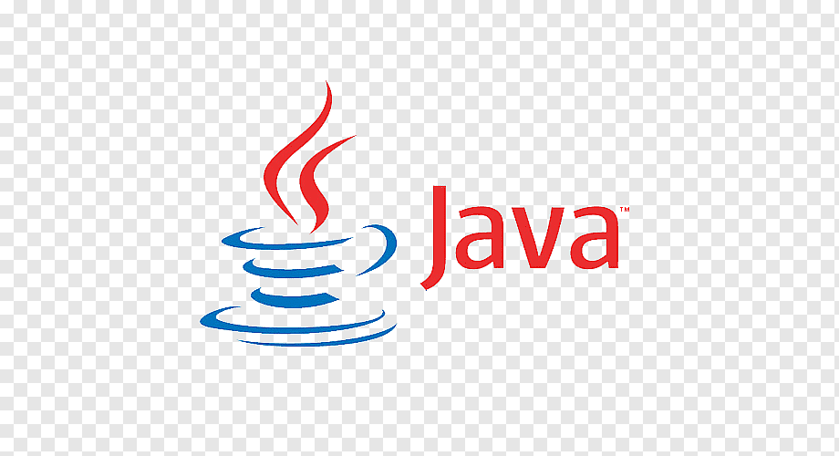
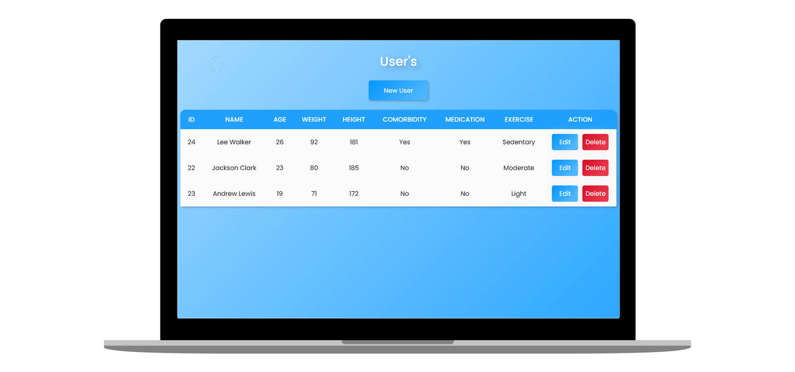
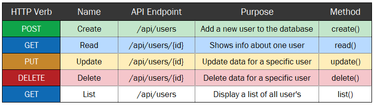

<h1 align="center">
    
</h1>

<h3 align="center">
  SelfCare
</h3>

 
 

  <a href="#sobre">Sobre</a>&nbsp;&nbsp;&nbsp;|&nbsp;&nbsp;&nbsp;
  <a href="#tecnologias">Tecnologias</a>&nbsp;&nbsp;&nbsp;|&nbsp;&nbsp;&nbsp;
  <a href="#licença">Licença</a>

  

## Sobre 
#### Objetivo e Escopo
O principal objetivo da aplicação 'SelfCare' parte da premissa de oferecer ao maior número de usuários possível, um meio seguro, prático e acessível para que estes possam cuidar melhor de sua saúde e bem-estar ao longo de sua vida. O produto será um dispositivo semelhante a uma pulseira, nomeada 'CareBand', que atuará em conjuto com um conjunto de sensores, monitorando e coletando dados vitais de seu usuário.  

Os dados coletados poderão ser utilizados por profissionais da área da saúde para investigar possíveis patologias presentes no organismo do indivíduo, além de possibilitar que o usuário detecte antecipadamente qualquer anormalidade ou irregularidade significativa em seus sinais vitais, dessa forma, evitando o agravamento de uma comorbidade ou distúrbio e aumentando as chances de sucesso do tratamento precoce do respectivo diagnóstico. 

A aplicação 'SelfCare' também contará com um aplicativo, inicialmente disponibilizado 
para Android, capaz de se conectar-se via Bluetooth com o dispositivo e captar 
as informações aferidas pelos sensores, armazenando-as de forma organizada e 
inteligente em uma sólida base de dados, permitindo que sejam visualizadas e 
consultadas pelo usuário de maneira intuitiva, conforme sua necessidade.

#### Arquitetura da Solução

  

#### Funcionalidades
O Back-End será responsável pela aplicação das regras de negócio definidas, além da comunicação com o banco de dados da aplicação.  

Por agora, a principal funcionalidade implementada na aplicação é a de comunicação com as informações dos usuários cadastrados. Através da interface de programação de aplicações 'API Rest', permitindo a interação com os serviços.  

Tal interação possibilitará a criação, listagem, alteração e até mesmo exclusão de informações de um usuário como: idade, peso, altura, frequência com que pratica atividades físicas, se possui comorbidades ou se está sob uso de medicações.

#### Tabela de End-Points

  

## Tecnologias

Esse projeto foi desenvolvido com as seguintes tecnologias:

- [Spring Framework](https://spring.io/)
- [Thymeleaf](https://www.thymeleaf.org/)
- [Maven](https://maven.apache.org/)
- [Lombok](https://projectlombok.org/)
- [JPA](https://spring.io/projects/spring-data-jpa)
- [SQL Developer](https://www.oracle.com/tools/downloads/sqldev-downloads.html)

## Licença

Esse projeto está sob a licença MIT. Consulte o arquivo [LICENSE](https://github.com/pedromiguelsbs/self-care/blob/main/LICENSE) para mais detalhes.
